# Headless CMS with Blog and Branch Locator

A full-stack web application built as an entry-level web developer technical examination project. Administrators manage blog posts, categories, authors, and branch locations through a Laravel Filament admin panel. The public website retrieves published content and active branches from the Laravel backend through a REST API and displays them using React, including an interactive OpenStreetMap branch locator.

---

## Project Overview

This project is a headless content management system where the backend (Laravel + Filament) and frontend (React) are decoupled. The backend exposes REST API endpoints that return JSON, and the frontend consumes those endpoints to render public pages.

**Core features:**

- Blog content management (posts, categories, authors)
- Branch location management with coordinates
- Public blog pages (listing, detail, by category)
- Interactive branch locator using OpenStreetMap
- Headless architecture (CMS + API + separate frontend)

---

## Demonstration

The following screenshots illustrate the main features of the application. All images are located in `demo/screenshots/`.

### Filament Admin Panel

**Login & Dashboard**

| Login page                                             | Dashboard                                                      |
| ------------------------------------------------------ | -------------------------------------------------------------- |
| 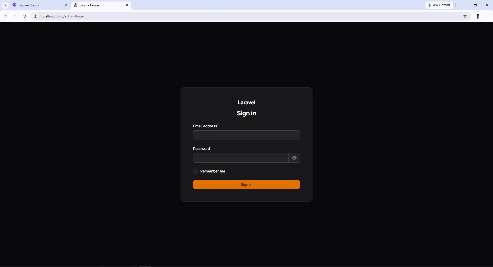 | 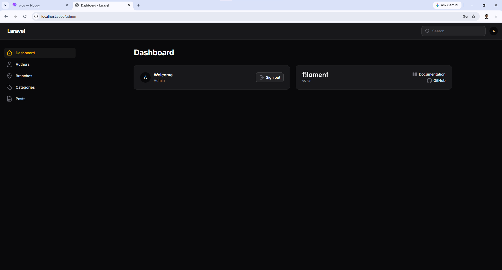 |

### Post Management (Admin)

| Post list                                    | Create post form                                      |
| -------------------------------------------- | ----------------------------------------------------- |
| 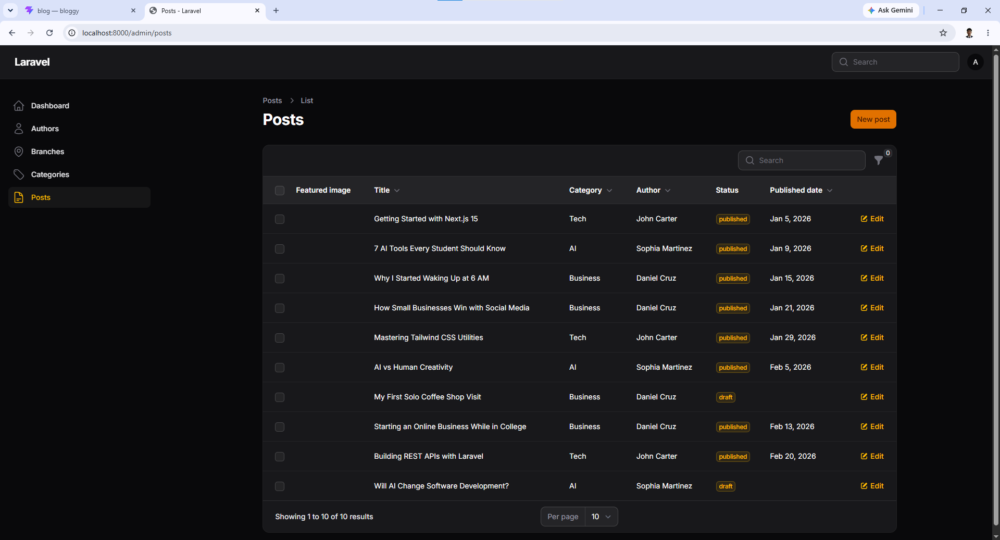 | 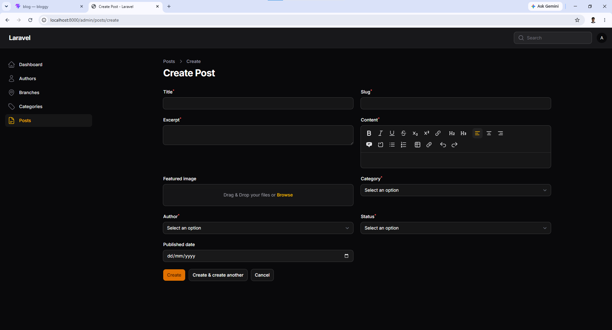 |

### Branch Management (Admin)

| Branch list                                          | Create branch form (with live map preview)                  |
| ---------------------------------------------------- | ----------------------------------------------------------- |
| 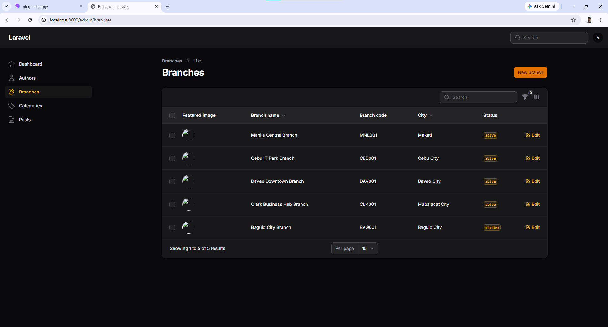 | 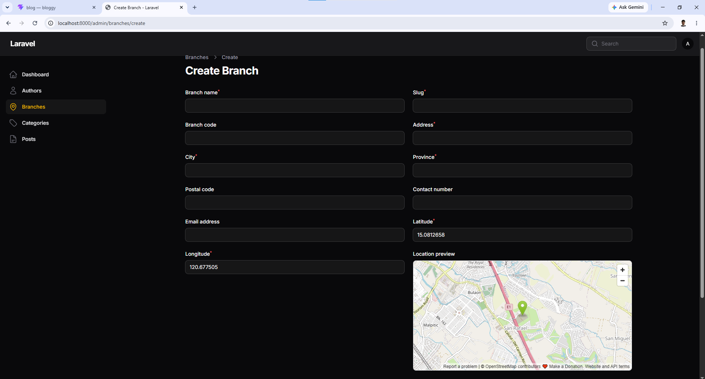 |

| Map preview on coordinate entry                                       |
| --------------------------------------------------------------------- |
| 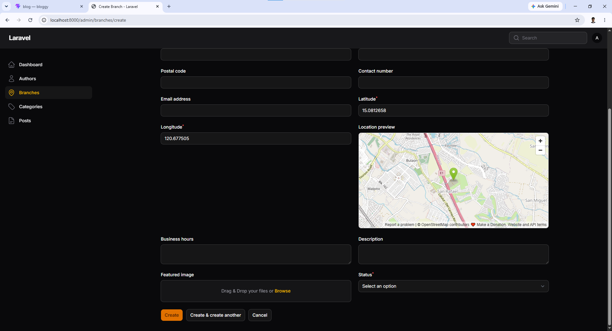 |

### Public Website — Home

| Home (top)                                     | Home (categories)                              |
| ---------------------------------------------- | ---------------------------------------------- |
| 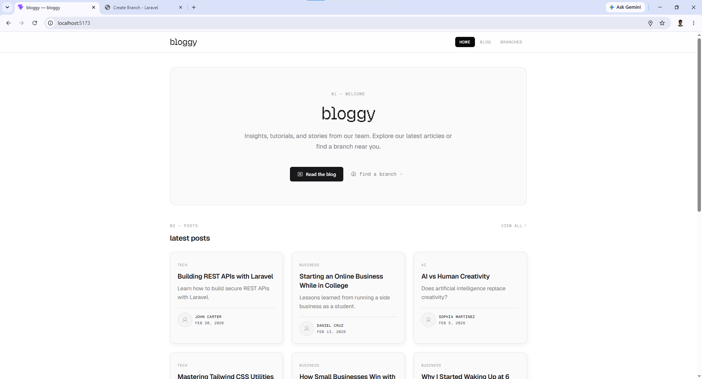 | 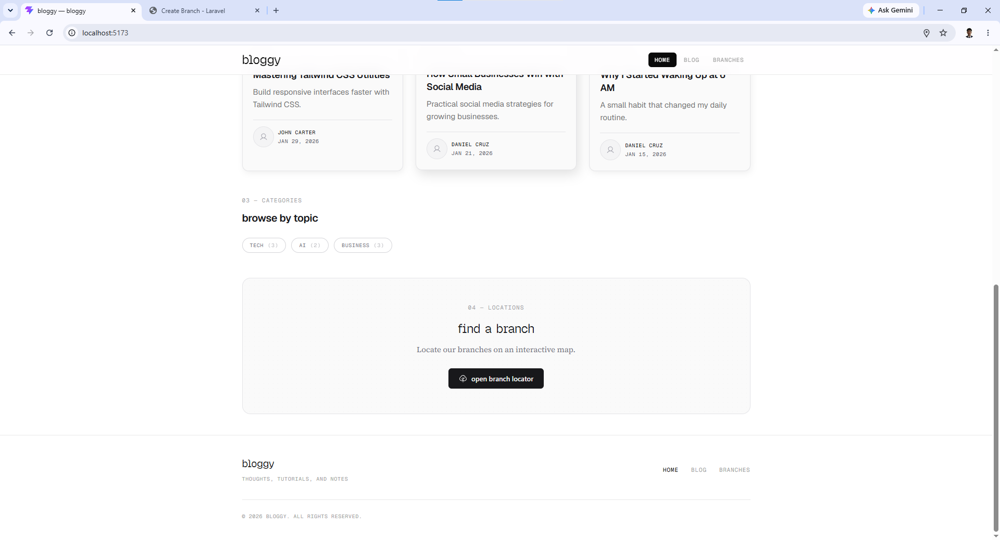 |

### Public Blog

| Blog listing                                           | Blog listing (alt view)                                |
| ------------------------------------------------------ | ------------------------------------------------------ |
| 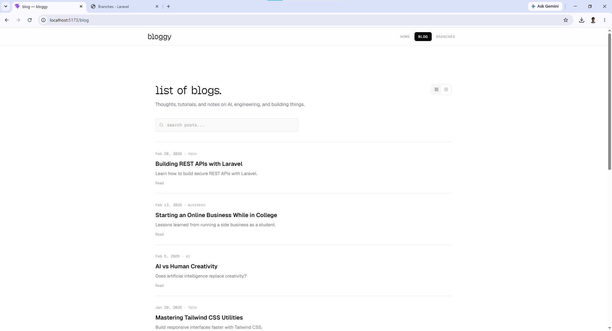 | 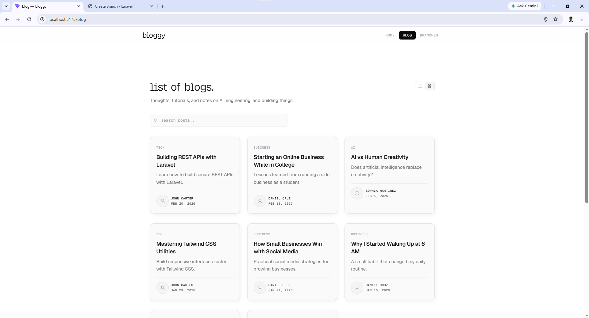 |

| Blog listing (grid)                                    | Blog detail (header + reading time)                   |
| ------------------------------------------------------ | ----------------------------------------------------- |
|  | 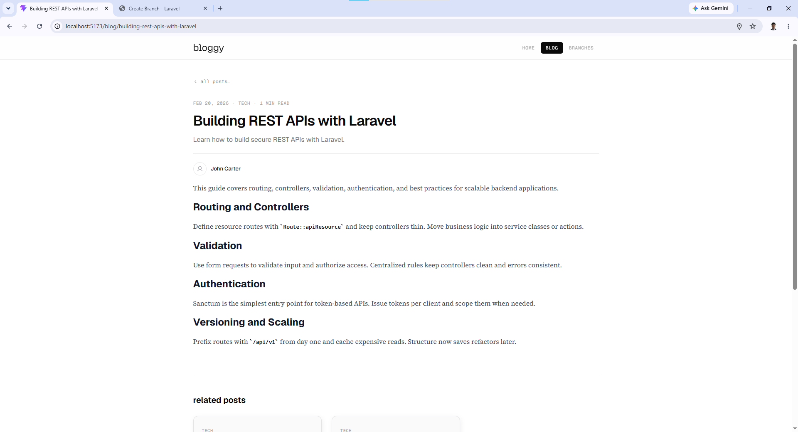 |

| Blog detail (content + related posts)                 |     |
| ----------------------------------------------------- | --- |
| 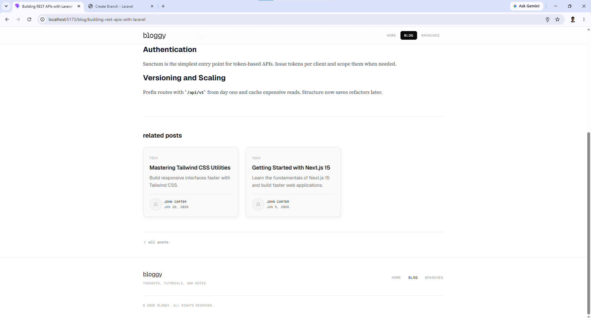 |     |

### Branch Locator (OpenStreetMap)

| Locator with map & markers                                 | Locator (search/filter)                                    | Locator (results)                                          |
| ---------------------------------------------------------- | ---------------------------------------------------------- | ---------------------------------------------------------- |
| 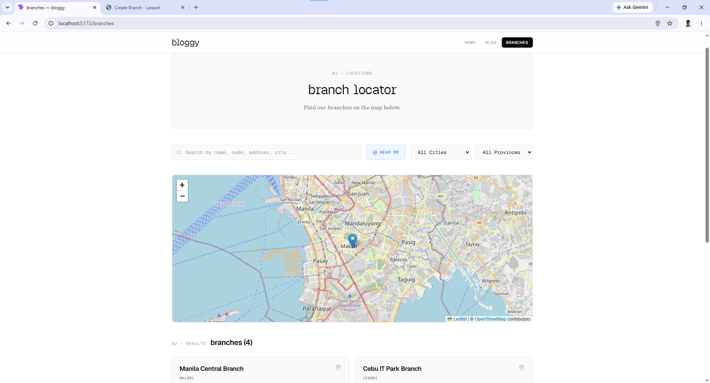 | 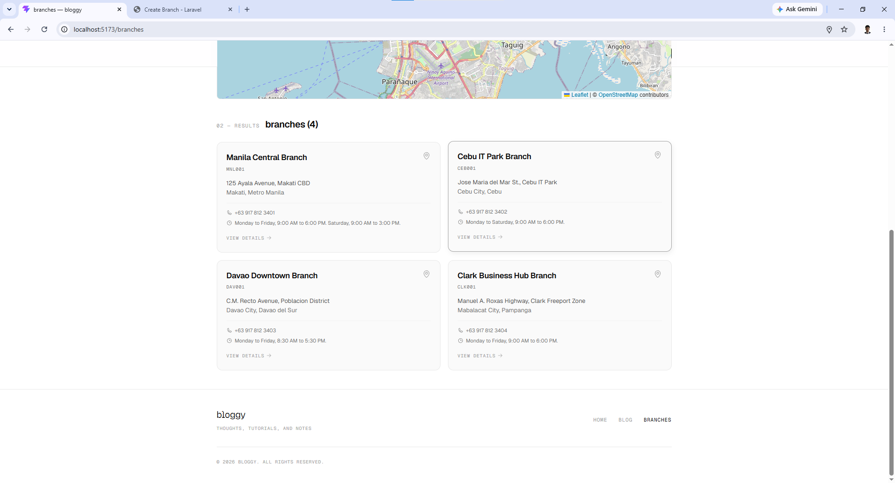 | 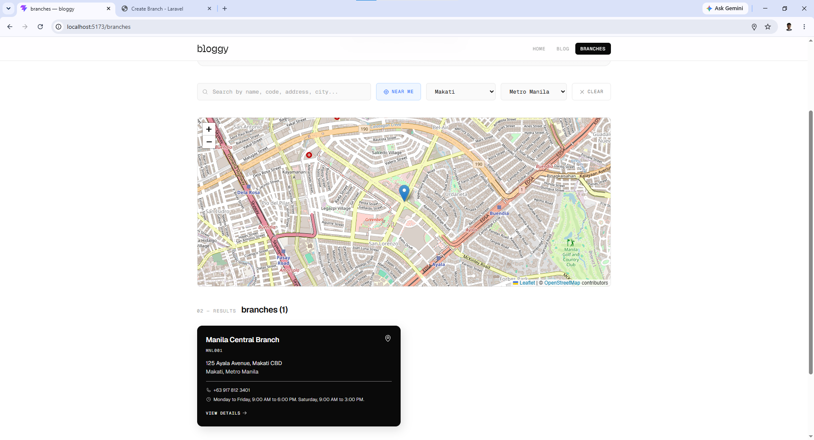 |

### Branch Detail

| Branch detail (info + map)                               | Branch detail (directions)                               |
| -------------------------------------------------------- | -------------------------------------------------------- |
| 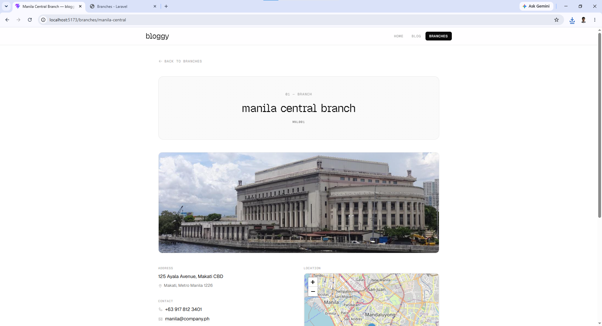 | 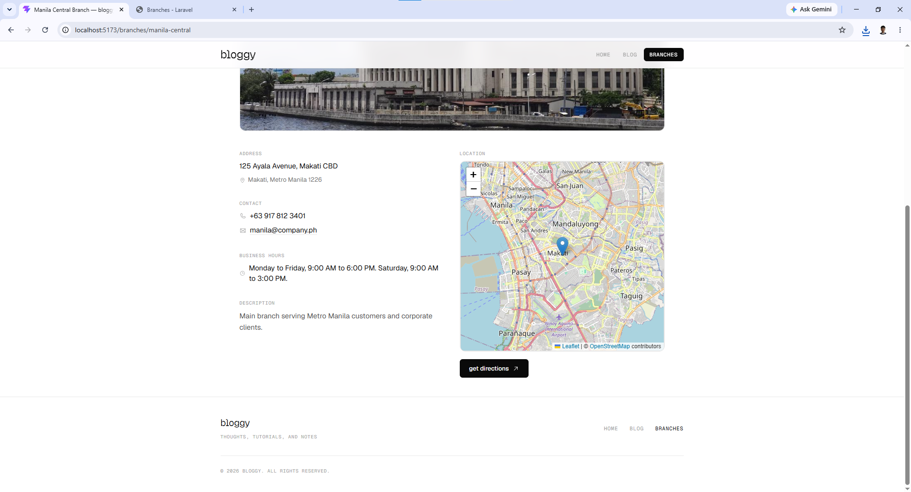 |

---

## Technologies Used

**Backend:**

- Laravel 13
- Filament v4 (admin panel)
- Laravel Eloquent ORM
- Laravel API Resources
- MySQL

**Frontend:**

- React 19
- Vite 8
- React Router 8
- Tailwind CSS v4
- Axios (HTTP client)
- Leaflet + React-Leaflet (OpenStreetMap maps)
- Phosphor Icons

**Maps:**

- OpenStreetMap (free map tiles)
- Leaflet.js / react-leaflet

---

## Project Structure

```
blog-app/
├── backend/                # Laravel + Filament application
│   ├── app/
│   │   ├── Filament/Resources/   # Admin resources (Categories, Authors, Posts, Branches)
│   │   ├── Http/Controllers/     # API controllers
│   │   ├── Http/Resources/       # API Resources (JSON transformers)
│   │   └── Models/               # Eloquent models
│   ├── database/migrations/
│   ├── database/seeders/
│   ├── routes/api.php            # API routes
│   └── config/cors.php           # CORS configuration
├── frontend/              # React + Vite application
│   ├── src/
│   │   ├── api/client.js         # Axios instance
│   │   ├── components/           # Reusable components (Layout, PostCard, MapView, etc.)
│   │   ├── pages/                # Page components (Home, BlogList, Branches, etc.)
│   │   ├── utils/formatDate.js   # Date formatting utility
│   │   └── App.jsx               # Router setup
│   └── package.json
└── README.md              # This file
```

---

## System Requirements

- PHP 8.2 or higher
- Composer
- MySQL 8.0 (or SQLite/PostgreSQL as alternative)
- Node.js 18+ and a package manager (npm/yarn/bun)
- Git

---

## Backend Installation

```bash
# 1. Navigate to the backend folder
cd backend

# 2. Install PHP dependencies
composer install

# 3. Copy the environment file
cp .env.example .env

# 4. Generate the application key
php artisan key:generate
```

---

## Frontend Installation

```bash
# 1. Navigate to the frontend folder
cd frontend

# 2. Install JavaScript dependencies
bun install
# (or: npm install)
```

---

## Database Setup

1. Create a MySQL database named `blog_app`.
2. Open `backend/.env` and configure the database connection:

```env
DB_CONNECTION=mysql
DB_HOST=127.0.0.1
DB_PORT=3306
DB_DATABASE=blog_app
DB_USERNAME=root
DB_PASSWORD=
```

> SQLite or PostgreSQL can be used instead by changing `DB_CONNECTION` and the relevant settings.

---

## Environment Variables

The backend relies on the following important environment variables (defined in `.env`):

| Variable          | Purpose                                                | Example                 |
| ----------------- | ------------------------------------------------------ | ----------------------- |
| `APP_URL`         | Backend base URL (used for image URLs)                 | `http://127.0.0.1:8000` |
| `DB_CONNECTION`   | Database driver                                        | `mysql`                 |
| `DB_DATABASE`     | Database name                                          | `blog_app`              |
| `FILESYSTEM_DISK` | Where uploaded files are stored — **must be `public`** | `public`                |

> ⚠️ **Important:** Set `FILESYSTEM_DISK=public` in your `.env` so uploaded images are accessible via URL. The default `local` disk stores files privately and the frontend cannot load them.

The `.env` file is excluded from version control. Use `.env.example` as a template.

---

## Migration Commands

```bash
cd backend
php artisan migrate
```

To reset and re-run all migrations:

```bash
php artisan migrate:fresh
```

---

## Seeding Commands

The project includes seeders that generate the minimum required sample data:

- 3 categories
- 3 authors
- 10 posts (at least 6 published, at least 2 draft)
- 5 branches (at least 4 active, at least 1 inactive)

```bash
cd backend
php artisan db:seed
```

To reset the database and seed in one command:

```bash
php artisan migrate:fresh --seed
```

---

## Filament Administrator Credentials

A default administrator account is included for evaluation:

```
Email:    admin@example.com
Password: admin
```

> These are examination-only credentials. Do not use them in production.

To create a new admin user manually:

```bash
php artisan make:filament-user
```

---

## Storage Setup

Image uploads (author profile images, post featured images, branch images) are stored using Laravel's public disk.

```bash
cd backend
php artisan storage:link
```

This creates a symlink from `public/storage` to `storage/app/public`, making uploaded files accessible via URL (e.g. `http://127.0.0.1:8000/storage/posts/xyz.jpg`).

Ensure `FILESYSTEM_DISK=public` is set in `.env` before uploading images.

---

## CORS Setup

CORS is configured so the React frontend (running on a different port) can call the backend API.

The configuration file is at `backend/config/cors.php`:

```php
'paths' => ['api/*'],
'allowed_origins' => ['http://localhost:5173', 'http://127.0.0.1:5173'],
```

If your frontend runs on a different URL, update `allowed_origins` accordingly. After changing CORS config:

```bash
php artisan config:clear
```

---

## API Base URL Configuration

The frontend's API client is at `frontend/src/api/client.js`:

```js
const client = axios.create({
  baseURL: 'http://127.0.0.1:8000/api',
  headers: { Accept: 'application/json' },
})
```

If your backend runs on a different host/port, update `baseURL` here.

---

## API Endpoint Documentation

All endpoints return JSON. Successful list responses follow Laravel's pagination format:

```json
{ "data": [...], "meta": { "current_page": 1, "last_page": 3 } }
```

Error responses follow this format:

```json
{ "message": "Post not found." }
```

### Posts

| Method | Endpoint                     | Description                                                                                 |
| ------ | ---------------------------- | ------------------------------------------------------------------------------------------- |
| GET    | `/api/posts`                 | List published posts (paginated, 9 per page). Drafts excluded.                              |
| GET    | `/api/posts?page=2`          | Paginated posts                                                                             |
| GET    | `/api/posts?search=laravel`  | Search posts by title (optional feature)                                                    |
| GET    | `/api/posts?category={slug}` | Filter posts by category slug                                                               |
| GET    | `/api/posts/{slug}`          | Single post with full content and reading time. Returns 404 for invalid slug or draft post. |
| GET    | `/api/posts/{slug}/related`  | Up to 3 related posts in the same category (excluding the current post).                    |

### Categories

| Method | Endpoint                       | Description                                                                     |
| ------ | ------------------------------ | ------------------------------------------------------------------------------- |
| GET    | `/api/categories`              | List all categories with `posts_count` (published posts only)                   |
| GET    | `/api/categories/{slug}/posts` | Published posts under a category (paginated). Returns 404 for invalid category. |

### Branches

| Method | Endpoint                                    | Description                                                                                                    |
| ------ | ------------------------------------------- | -------------------------------------------------------------------------------------------------------------- |
| GET    | `/api/branches`                             | List active branches only. Inactive excluded. Supports query params below.                                     |
| GET    | `/api/branches?search=makati`               | Search across branch name, code, address, city, province                                                       |
| GET    | `/api/branches?city=Makati`                 | Filter by city                                                                                                 |
| GET    | `/api/branches?province=Bulacan`            | Filter by province                                                                                             |
| GET    | `/api/branches/nearby?latitude=&longitude=` | Up to 10 nearest active branches ordered by distance (Haversine). Validates lat (-90..90) and lng (-180..180). |
| GET    | `/api/branches/{slug}`                      | Single active branch with full details. Returns 404 for invalid slug **or inactive branch**.                   |

### HTTP Status Codes Used

- `200 OK` — successful request
- `404 Not Found` — record not found, invalid slug, draft post, or inactive branch
- `422 Unprocessable Entity` — validation error (e.g., nearby endpoint with invalid latitude/longitude)
- `500 Internal Server Error` — server-side failure

---

## Running the Backend

```bash
cd backend
php artisan serve
```

The backend will be available at `http://127.0.0.1:8000`.

- Filament admin panel: `http://127.0.0.1:8000/admin`
- API base URL: `http://127.0.0.1:8000/api`

---

## Running the Frontend

```bash
cd frontend
bun run dev
# (or: npm run dev)
```

The frontend will be available at `http://localhost:5173`.

> Both backend and frontend must be running simultaneously for the application to work.

---

## OpenStreetMap Library Used

- **Leaflet.js** (v1.9) — open-source JavaScript mapping library
- **react-leaflet** (v5) — React wrapper for Leaflet
- **Map tiles** — OpenStreetMap standard tile layer (`tile.openstreetmap.org`)
- **Attribution** — `© OpenStreetMap contributors` is displayed on every map

No paid map service is used.

---

## Geocoding Service

This project does **not** use a geocoding service. Branch coordinates (latitude and longitude) are entered manually by the administrator in the Filament branch form, as permitted by the examination requirements.

The frontend uses the browser's native `navigator.geolocation` API for the "Find branches near me" feature. This is **not** geocoding — it relies on the visitor's device (GPS/IP) and requires their permission. No external geocoding API is called.

If address geocoding is desired in the future, a compatible service such as Nominatim (OpenStreetMap) could be integrated — but coordinates must be cached to avoid excessive requests.

---

## Known Limitations

- Branch search/filtering on the locator page is performed client-side after a single API fetch. For very large branch counts, the server-side `/api/branches/nearby` endpoint (Haversine) would scale better.
- Post search is limited to the title field.
- No authentication on public API endpoints (intentional — content is public).
- No automated tests included (manual testing performed; see below).
- Rich text content is rendered with `dangerouslySetInnerHTML`. In production, consider sanitizing HTML server-side.
- Browser geolocation requires HTTPS in production (works on `localhost` in development).

---

## Unfinished Features

None. All core requirements from the examination specification are implemented and tested.

---

## Optional Features Implemented

**Frontend enhancements:**

- Author profile image displayed in post cards and post detail
- Post search on the blog listing page (`?search=` with debounce)
- Blog list view toggle (list view / grid view) with preference persisted in `localStorage`
- "Get Directions" link on branch detail opening OpenStreetMap with the branch location
- Map flies to a branch when its list card is clicked (focus interaction)
- Loading spinner with contextual labels per page
- Dynamic document titles per page (SEO-friendly browser tab titles)
- Lazy-loaded images for faster initial page loads
- "Find branches near me" button using browser geolocation, with distance sorting and per-card distance display
- Related posts grid on the blog detail page
- Reading time estimate on the blog detail page (e.g., "5 min read")

**Backend enhancements:**

- Related posts endpoint (`GET /api/posts/{slug}/related`)
- Nearby branch endpoint (`GET /api/branches/nearby`) using the Haversine formula in SQL, with latitude/longitude validation
- Reading time computed server-side in the Post API Resource

**Admin (Filament) enhancements:**

- Live OpenStreetMap map preview inside the branch form (updates as coordinates are entered)
- Distinct navigation icons for each Filament resource (Category, Author, Post, Branch)

---

## Manual Testing

The following flows have been manually tested:

- Filament login with admin credentials
- Category / Author / Post / Branch CRUD in the admin panel
- Image uploads (author, post, branch)
- Post status filtering (draft/published) in the admin
- Branch status filtering (active/inactive) in the admin
- Branch coordinate validation (latitude -90..90, longitude -180..180)
- Live map preview in the branch form
- API pagination
- Category filtering
- Post search (`?search=`)
- Branch search and city/province filtering
- Related posts endpoint
- Nearby branch endpoint with valid and invalid coordinates
- Blog listing, detail, and category pages
- Post search on the blog listing page
- Reading time display on blog detail
- Related posts grid on blog detail
- Branch locator map markers and popups
- "Find branches near me" (geolocation + distance sorting)
- Branch detail page with directions
- Loading, empty, error, and not-found states
- Document titles per page
- Responsive layouts (desktop, tablet, mobile)

---

## Admin Credentials (Recap)

```
URL:      http://127.0.0.1:8000/admin
Email:    admin@example.com
Password: admin
```
